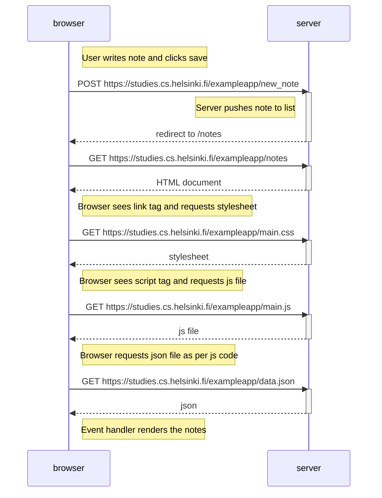

# Teht. 0.4 / Ex. 0.4

```mermaid
sequenceDiagram
    participant browser
    participant server
    
    Note right of browser: User writes note and clicks save

    browser->>server: POST https://studies.cs.helsinki.fi/exampleapp/new_note
    activate server
    Note left of server: Server pushes note to list
    server-->>browser: redirect to /notes
    deactivate server

    browser->>server: GET https://studies.cs.helsinki.fi/exampleapp/notes
    activate server
    server-->>browser: HTML document
    deactivate server

    Note right of browser: Browser sees link tag and requests stylesheet
    browser->>server: GET https://studies.cs.helsinki.fi/exampleapp/main.css
    activate server
    server-->>browser: stylesheet
    deactivate server
    
    Note right of browser: Browser sees script tag and requests js file
    browser->>server: GET https://studies.cs.helsinki.fi/exampleapp/main.js
    activate server
    server-->>browser: js file
    deactivate server

    Note right of browser: Browser requests json file as per js code
    
    browser->>server: GET https://studies.cs.helsinki.fi/exampleapp/data.json
    activate server
    server-->>browser: json
    deactivate server    

    Note right of browser: Event handler renders the notes

```