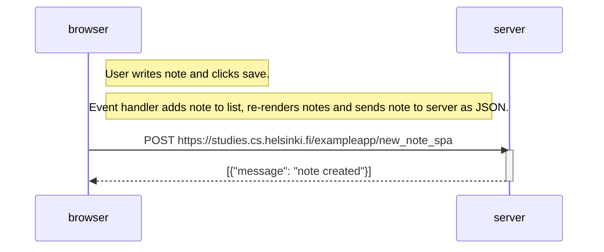

# Teht. 0.6 / Ex. 0.6

```mermaid
sequenceDiagram
    participant browser
    participant server
    
    Note right of browser: User writes note and clicks save. 
    Note right of browser: Event handler adds note to list, re-renders notes and sends note to server as JSON.
    browser->>server: POST https://studies.cs.helsinki.fi/exampleapp/new_note_spa

    activate server
    server-->>browser: [{"message": "note created"}]
    deactivate server

```